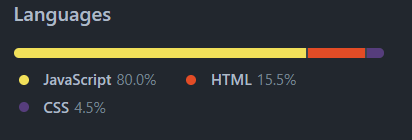

# Budget Tracker
## 
## User story
### The client is an avid traveler and wants to be able to track the withdrawals and deposits with or without a data/internet connection an to keep an account balance that is accurate when traveling.
#
# 
## Links to project 
* Github: https://github.com/AndreBlankholm/budget-tracker
* Heroku: https://serene-escarpment-81832.herokuapp.com/
#
Screenshot:
# 

#
The MIT license 
## 
### License & copyright © Andre Blankholm, U of M Coding Bootcamp

